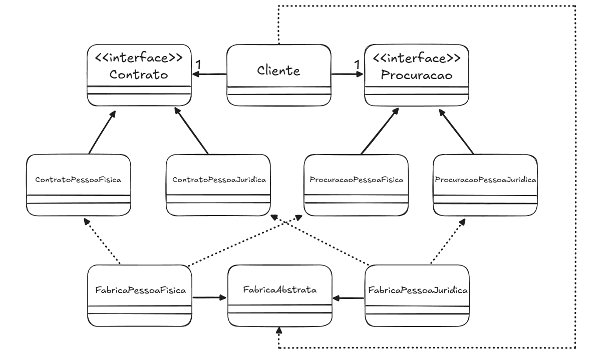

## Descrição

O **Abstract Factory** é um padrão criacional que permite a criação de famílias de objetos relacionados sem especificar suas classes concretas. Ele promove a flexibilidade ao desacoplar a criação dos objetos de suas implementações específicas.

## Utilização no Exemplo

No exemplo, a interface `FabricaAbstrata` define métodos para criar objetos `Procuracao` e `Contrato`. As fábricas concretas (`FabricaPessoaFisica` e `FabricaPessoaJuridica`) implementam essa interface, criando variações específicas dos documentos. A classe `Cliente` utiliza uma fábrica abstrata para obter esses objetos, sem conhecer suas implementações concretas, garantindo maior modularidade e facilidade de manutenção.

## Aluno

- **Nome:** Marcos Vinicius dos Reis Nascimento
- **Matrícula:** 0900037008
- **Curso:** Engenharia de Software